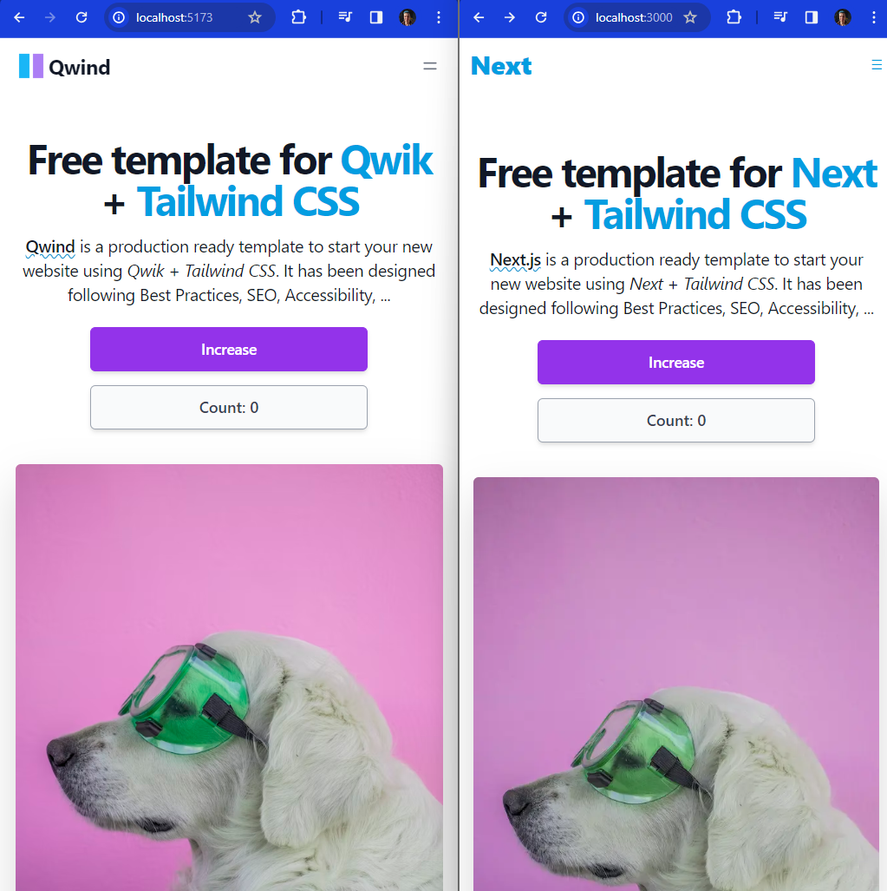
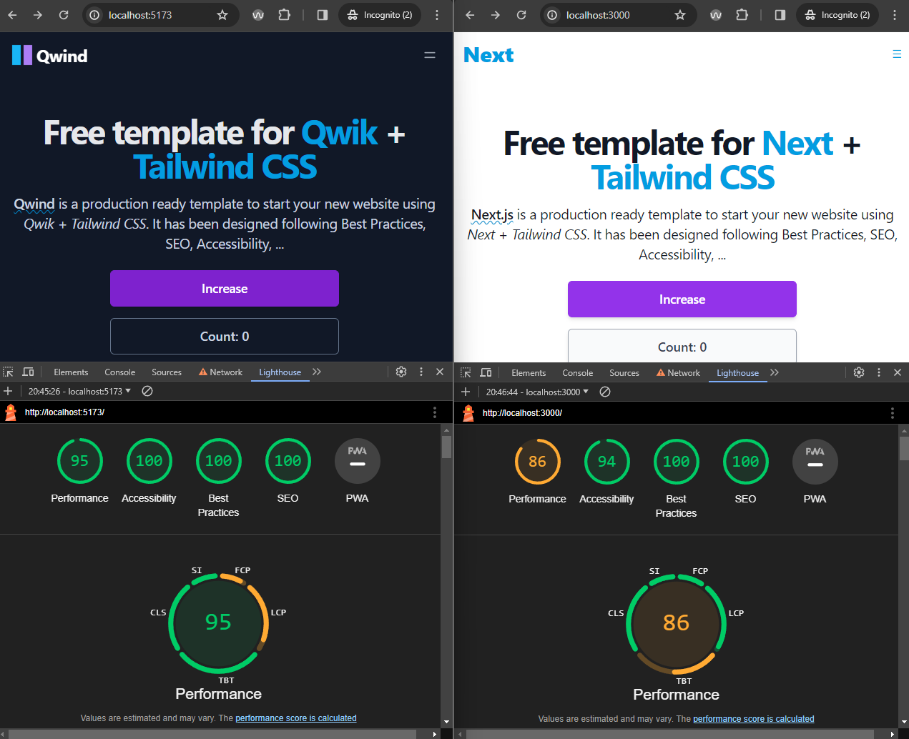

# Comparing Hydration in Next.js vs. Qwik

Analyze the performance impact of different hydration strategies by comparing React, Next.js, and Qwik frameworks. I assumed that Qwik's reusable hydration approach would lead to superior performance metrics. However, as a pragmatic person, I have to verify it firsthand.

### Goal:

See if/how Qwik's hydration is faster than Next using Lighthouse metrics (LCP, TTFB, TTI).

### Steps:

- Build the same app in both frameworks (buttons, modal, tabs)
- Deploy both apps on localhosts
- Run Lighthouse in the browser dev console for each app
- Compare results, focusing on LCP, TTFB, and TTI

### Expected Outcome:

Understand if Qwik's hydration leads to better performance.

### Success: 
Sooner or later, to be continued...

### Action Points:

- [x] Test apps run
- [ ] Lighthouse results obtained
- [ ] Conclusions drawn

_________________________

## Testing Apps Run

I executed the applications on localhost to ensure a fair comparison. Both the Next.js and Qwik versions were run and tested for functionality and responsiveness.

## Lighthouse Results

## Conclusions
